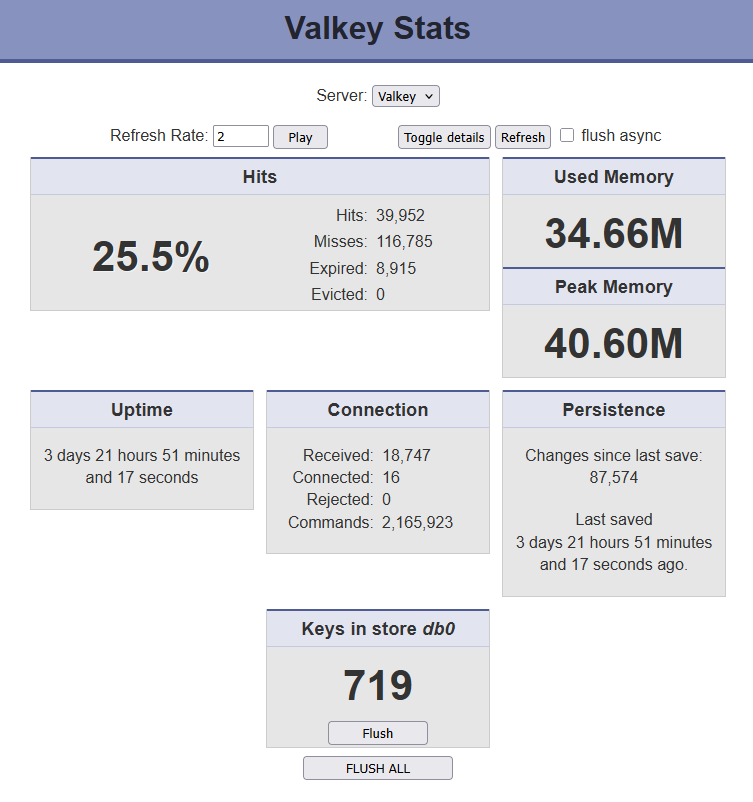

# valkeystats

[](screenshot.png)

**Disclaimer**: This is a fork of **[tessus/valkey-stats](https://github.com/tessus/valkey-stats)** and provides a Docker image using **[Trafex/docker-php-nginx](https://github.com/TrafeX/docker-php-nginx)**.

* Ready-to-use image is available from the **[Docker Hub](https://hub.docker.com/r/l33tlamer/valkeystats)** registry. Currently `amd64` only.

* When used without environment variables or config file, a default of `localhost:6379` will try to be used.

* For a single Valkey/Redis instance, supply the environment variables `VALKEY_NAME`, `VALKEY_HOST` and `VALKEY_PORT` to overwrite the defaults.

* For multiple instances, do NOT use the variables but instead mount `config.php` to `/var/www/html/config.php` in the container.

* The template for `config.php` file can be downloaded from the repo here or copied out of a running container:
* * `docker cp valkeystats:/var/www/html/config.template.php ./config.php`

* Edit the config file to list **multiple Valkey/Redis instances**, examples are also provided for usage with **socket**, and **user/password**.

Usage examples:

* `docker run -d --name valkeystats -p 8080:8080 l33tlamer/valkeystats`

* `docker run -d --name valkeystats -e -e VALKEY_NAME=Valkey VALKEY_HOST=192.168.20.50 -e VALKEY_PORT=6379 -p 8080:8080 l33tlamer/valkeystats`

* `docker run -d --name valkeystats -v config.php:/var/www/html/config.php -p 8080:8080 l33tlamer/valkeystats`

* For Docker Compose a `docker-compose.example.yml` file exists in the root of this repo.


*From the original valkey-stats the update-checker and footer have been removed.*

___

# The following is the original README:

# valkey-stats

## Features

- lightweight
- no PHP valkey/redis module required
- tls support (PHP valkey/redis module required)
- connection via IP/hostname/port or socket
- password support (including Valkey/Redis 6 ACLs)
- show details
- flush database (async support)
- flush instance (async support)
- command mapping support (when rename-command is used on the server)
- auto refresh
- check for update

## Installation

```bash
git clone --depth 1 https://github.com/tessus/valkey-stats.git
cd valkey-stats
cp config.template.php config.php
```

## Configuration

### Server information

Servers are defined as an array. There are a few examples in the `config.template.php` file.

Field     | Type          | Description
----------|---------------|------------------------------------------------------------------------------
Name      | string        | name shown in drop-down list (also used for tls options and command mapping)
IP/Socket | string        | IP address, hostname, or socket (`unix://`) of the server
Port      | integer       | port of server, use -1 for socket
Password  | string, array | credentials for the server (optional)<br>string: `password`<br>array: `['user', 'password']` for Valkey/Redis ACLs

e.g.:

```php
$servers = [
        [ 'Local', '127.0.0.1', 6379 ],
        [ 'Local socket', 'unix:///var/run/valkey.sock', -1 ],
        [ 'Local with password', '127.0.0.1', 6379, 'password_here' ],
        [ 'Local with user and password', '127.0.0.1', 6379, ['username', 'password_here'] ],
        [ 'TLS connection with user and password', 'tls://localhost', 6379, ['username', 'password_here'] ],
];
```

### TLS configuration

If an IP address or hostname starts with `tls://`, a TLS context is created for that connection.
The `default-options` apply to all TLS connections and can be overridden by connection specific options.

For a list of possible options, please have a look at the [SSL context options](https://www.php.net/manual/en/context.ssl.php#refsect1-context.ssl-options) in the PHP manual.

```php
$tls = [
        'default-options' => [ // these are the default TLS options
                'verify_peer'       => true,
                'verify_peer_name'  => true,
                'allow_self_signed' => false,
        ],
        'TLS connection with user and password' => [ // must be a server name (first field in server array, name shown in drop-down list)
                'local_cert' => '/path/to/client.pem',
                'local_pk'   => '/path/to/clientkey.pem',
                'cafile'     => '/path/to/cacert.crt'
        ]
];
```

### Misc options

Name                 | Default   | Description
---------------------|-----------|---------------------------------------------------------------
FLUSHDB              | true      | Show a 'Flush' button for databases
CONFIRM_FLUSHDB      | true      | Ask for confirmation before flushing database
FLUSHALL             | true      | Show a 'Flush All' button for the instance
CONFIRM_FLUSHALL     | true      | Ask for confirmation before flushing the entire instance
STATUS_LINE          | "bottom"  | Position of status line: "bottom" or "top"
CHECK_FOR_UPDATE     | true      | Show a 'Check for update' button
USE_MODULE_IF_LOADED | true      | Use the php extension, if loaded
DEBUG                | false     | debug mode - you don't want to set this to true!

### Command mapping

In case commands have been renamed on the server, there's support to map these commands in the config file.
Please note that this has been deprecated for years and is not supported when using the extension (module).

e.g.:

```php
$command = [
        'Local'    => [ // must be a server name (first field in server array, name shown in drop-down list)
                'FLUSHDB'  => 'fdb-5dea06694ff64',
                'FLUSHALL' => 'fa-5dea067c9bbd6',
                'AUTH'     => '',
                'INFO'     => '',
        ],
];
```

## Screenshot


## Acknowledgements

I found the original script at <https://gist.github.com/kabel/10023961>
